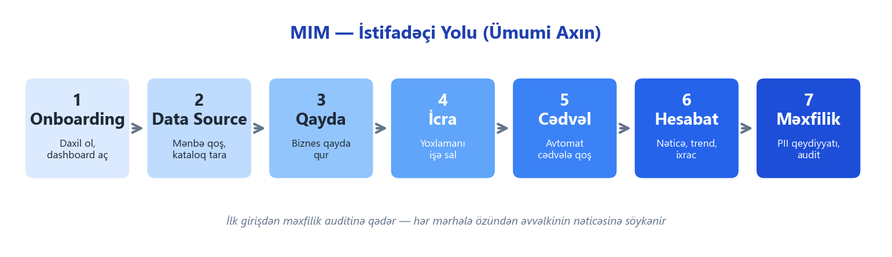
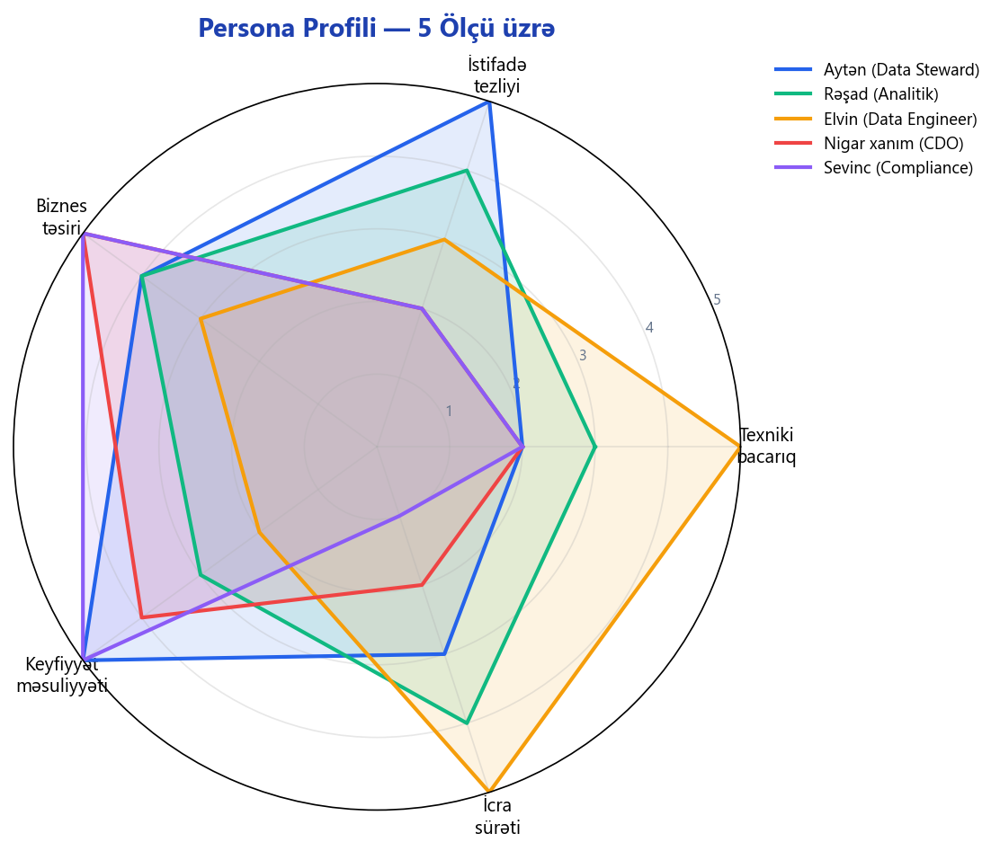
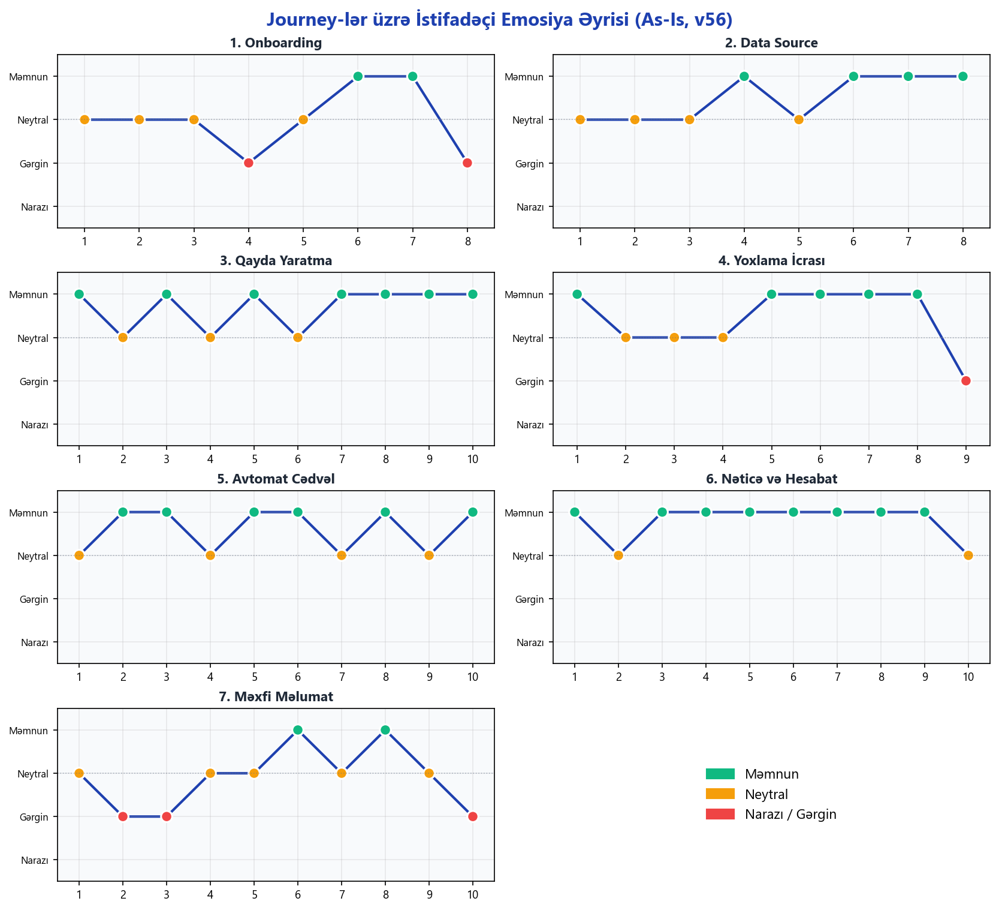
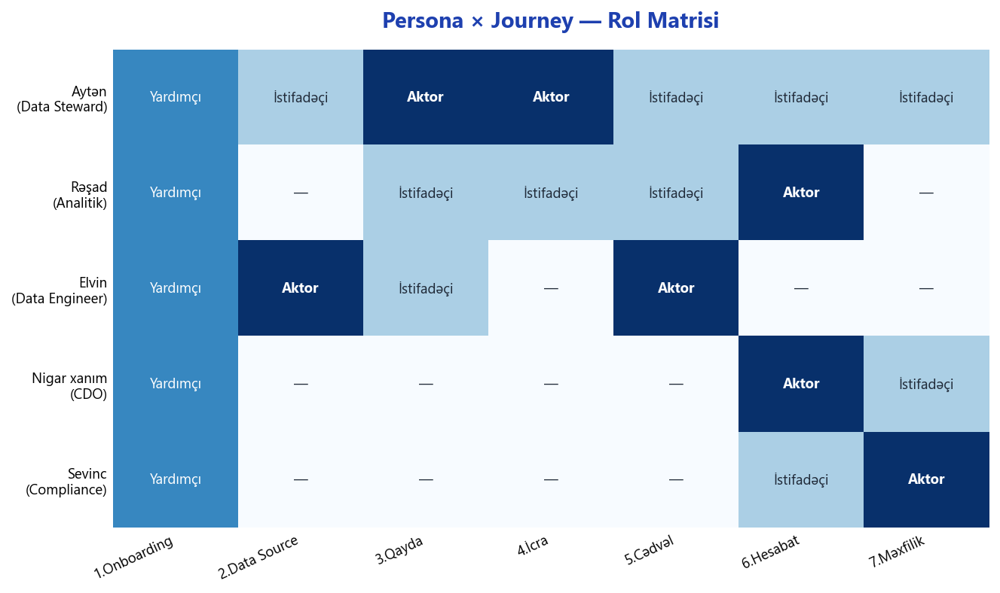
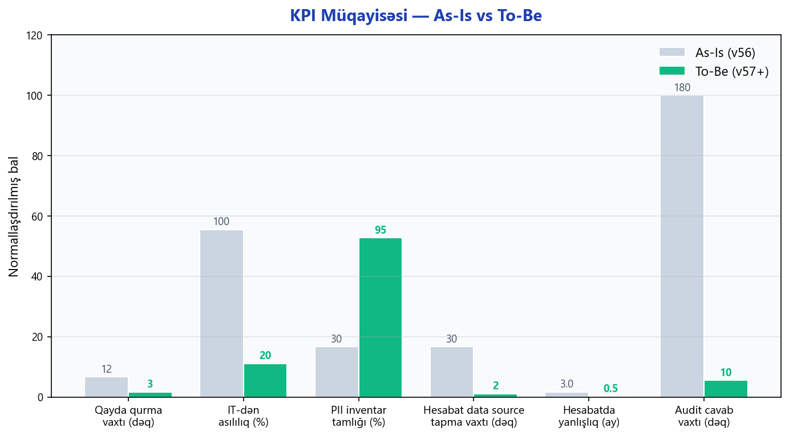
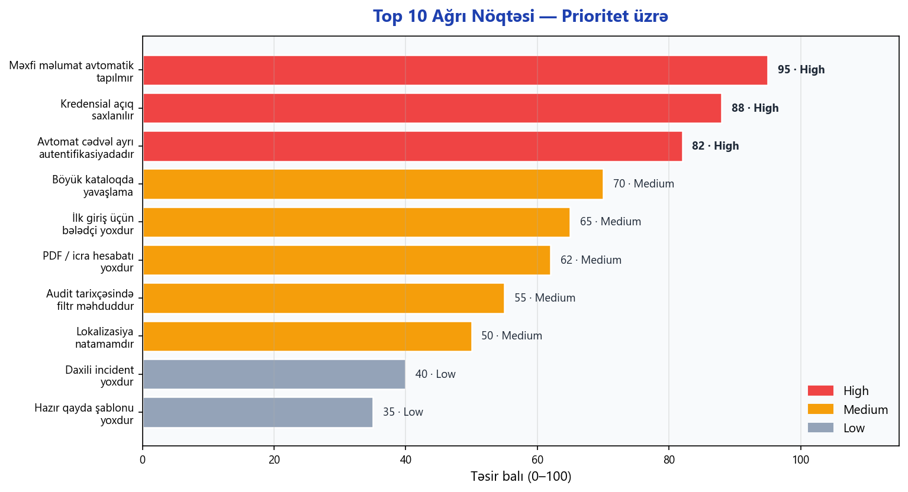
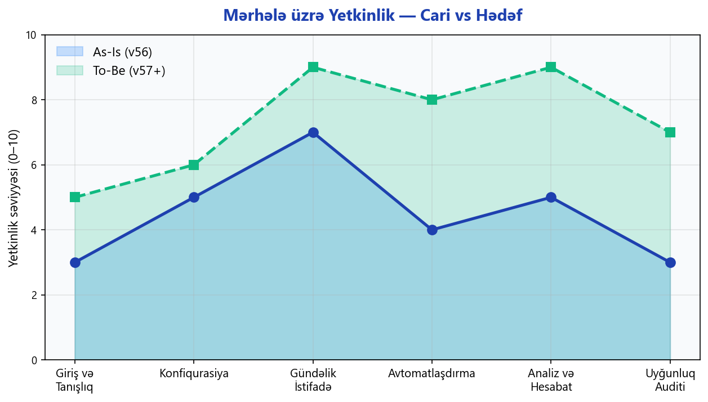

# MIM — İstifadəçi Səyahəti (User Journey)

**Versiya:** v56 (Cari) → v57+ (Hədəf)
**Hədəf auditoriya:** Biznes liderlər, məhsul menecerləri, data governance komandası
**Dil:** Azərbaycan dili

---

## 0. Qısa Xülasə

MIM — kiçik və orta biznes üçün nəzərdə tutulmuş data keyfiyyəti və data governance platformasıdır. Məhsul aşağıdakı əsas funksiyaları əhatə edir:

- Verilənlər bazalarının mərkəzi kataloqu (layer → cədvəl → sütun səviyyəsində)
- Biznes qaydalarının (data quality rules) yaradılması və icrası
- Avtomatik cədvəl ilə gündəlik / həftəlik yoxlamalar
- Hesabat və nəticə analizi, trend görüntüləməsi
- Biznes glossary, domen və stakeholder idarəetməsi
- Rollar, icazələr, audit tarixçəsi

Bu sənəd **cari vəziyyəti (as-is)** 7 journey üzrə, 5 persona baxımından təsvir edir və **hədəf vəziyyəti (to-be)** müəyyənləşdirir.

---

## Mündəricat

1. [Persona-lar](#1-persona-lar)
2. [Journey 1 — Onboarding](#journey-1--onboarding)
3. [Journey 2 — Data Source Qoşma](#journey-2--data-source-qoşma)
4. [Journey 3 — Biznes Qayda Yaratma](#journey-3--biznes-qayda-yaratma)
5. [Journey 4 — Yoxlamanın İcrası](#journey-4--yoxlamanın-icrası)
6. [Journey 5 — Avtomatik Cədvəl](#journey-5--avtomatik-cədvəl)
7. [Journey 6 — Nəticə Analizi və Hesabat](#journey-6--nəticə-analizi-və-hesabat)
8. [Journey 7 — Məxfi Məlumat və Audit](#journey-7--məxfi-məlumat-və-audit)
9. [Emosiya Əyrisi](#8-emosiya-əyrisi-bütün-journey-lər)
10. [Persona × Journey Matrisi](#9-persona--journey-matrisi)
11. [Uğur Metrikləri (KPI)](#10-uğur-metrikləri-kpi)
12. [Ağrı Nöqtələri — Top 10](#11-ağrı-nöqtələri--top-10)
13. [Yetkinlik Mənzərəsi](#12-yetkinlik-mənzərəsi)
14. [Hədəf Vəziyyət (To-Be)](#13-hədəf-vəziyyət-to-be)
15. [Terminlər Lüğəti](#14-terminlər-lüğəti)

---

## 1. Persona-lar

Aşağıdakı 5 persona MIM-in əsas istifadəçi bazasını təmsil edir.

### 1.1 Aytən — Data Steward

| Sahə | Məzmun |
|------|--------|
| **Ad və rol** | Aytən — Data Steward |
| **Texniki səviyyə** | 2 / 5 |
| **Əsas məqsəd 1** | Müştəri məlumatlarının tamlığı və dəqiqliyini təmin etmək |
| **Əsas məqsəd 2** | Biznes glossary qurmaq, termin sahiblərini müəyyən etmək |
| **Əsas məqsəd 3** | Aşkar edilən problemləri aidiyyəti üzrə ötürmək |
| **Ağrı 1** | Hər problem Excel-ə köçürülür — versiyalaşdırma yoxdur |
| **Ağrı 2** | Sadə qaydaları özü qura bilmir, texniki komandadan asılıdır |
| **Ağrı 3** | Cədvəlin sahibinin kim olduğu hər zaman aydın deyil |
| **Gözlənti 1** | Kod yazmadan qayda qurmaq imkanı |
| **Gözlənti 2** | Problemli sətirləri bir kliklə Excel-ə endirmək |
| **Gözlənti 3** | Glossary termini birbaşa sütuna bağlamaq |

### 1.2 Rəşad — Data Analyst

| Sahə | Məzmun |
|------|--------|
| **Ad və rol** | Rəşad — BI / Data Analyst |
| **Texniki səviyyə** | 3 / 5 |
| **Əsas məqsəd 1** | Hesabat üçün istifadə edilən cədvəllərin keyfiyyətinə əmin olmaq |
| **Əsas məqsəd 2** | Metrik tərifini glossary-dən götürmək |
| **Əsas məqsəd 3** | Hesabatın data mənbələri ilə əlaqəsini göstərmək |
| **Ağrı 1** | Hesabat təhvil verildikdən sonra rəqəmin səhv olduğu məlum olur |
| **Ağrı 2** | Hansı cədvəldəki boşluğun hesabatı sındırdığını tapmaq saatlar alır |
| **Ağrı 3** | Kolleqalarla eyni metrikin fərqli tərifləri ola bilir |
| **Gözlənti 1** | Hər cədvəl üçün son yoxlama nəticəsi birbaşa göz önündə |
| **Gözlənti 2** | Hesabatla mənbələr arası əlaqə (lineage) avtomatik |
| **Gözlənti 3** | Dashboard-da son 30 günün trend qrafiki |

### 1.3 Elvin — Data Engineer

| Sahə | Məzmun |
|------|--------|
| **Ad və rol** | Elvin — Data Engineer |
| **Texniki səviyyə** | 5 / 5 |
| **Əsas məqsəd 1** | MIM-i data axınına inteqrasiya etmək |
| **Əsas məqsəd 2** | Yeni mənbələri avtomatik kataloqa yazdırmaq |
| **Əsas məqsəd 3** | Qaydaları versiya idarəetmə sistemində saxlamaq |
| **Ağrı 1** | UI-dan edilən dəyişikliklər versiya sistemində görünmür |
| **Ağrı 2** | Cədvəl servisi ilə əsas platforma arasında vahid autentifikasiya yoxdur |
| **Ağrı 3** | Rəsmi API sənədi yoxdur, inteqrasiya qeyri-müəyyəndir |
| **Gözlənti 1** | Rəsmi API açarı və sənədləşdirmə |
| **Gözlənti 2** | Hazır Docker paketi |
| **Gözlənti 3** | Cədvəllərin JSON / YAML ilə ixrac-idxalı |

### 1.4 Nigar xanım — CDO / IT Rəhbəri

| Sahə | Məzmun |
|------|--------|
| **Ad və rol** | Nigar xanım — Chief Data Officer |
| **Texniki səviyyə** | 2 / 5 |
| **Əsas məqsəd 1** | Data keyfiyyətinin şirkət səviyyəsində ölçülə bilməsi |
| **Əsas məqsəd 2** | Tənzimləyici tələblərə uyğunluq sübutu |
| **Əsas məqsəd 3** | Data investisiyalarının gəlirliliyini göstərmək |
| **Ağrı 1** | Hər departament keyfiyyəti fərqli ölçür, müqayisə mümkün deyil |
| **Ağrı 2** | Auditor dəyişiklik tarixçəsini soruşanda cavab yox |
| **Ağrı 3** | Governance büdcəsini əsaslandıracaq rəqəm yoxdur |
| **Gözlənti 1** | Tək səhifədə ümumi göstərici və domen breakdown |
| **Gözlənti 2** | Dəyişməz audit tarixçəsi |
| **Gözlənti 3** | Məxfi məlumat üzrə risk xəritəsi |

### 1.5 Sevinc — Compliance Officer

| Sahə | Məzmun |
|------|--------|
| **Ad və rol** | Sevinc — Compliance / Data Protection Officer |
| **Texniki səviyyə** | 2 / 5 |
| **Əsas məqsəd 1** | Hansı sütunların məxfi məlumat saxladığını dəqiq bilmək |
| **Əsas məqsəd 2** | Tənzimləyici tələblərin icra olunduğunu sübut etmək |
| **Əsas məqsəd 3** | Data saxlama müddətlərinə uyğunluğu yoxlamaq |
| **Ağrı 1** | Məxfi məlumat inventarı Excel-dədir və aylarla yenilənmir |
| **Ağrı 2** | Hesabatların məxfi məlumat saxlaması qeyd olunmur |
| **Ağrı 3** | Audit zamanı sütunun maskalanması sualına cavab uzun çəkir |
| **Gözlənti 1** | Avtomatik məxfi məlumat tapma funksiyası |
| **Gözlənti 2** | Tənzimləyici bayraqlar üçün standart variantlar |
| **Gözlənti 3** | Məxfi sütunların saxlama müddəti ilə bağlanması |

---

## Journey 1 — Onboarding

**Persona:** Aytən (və bütün rollar üçün eynidir)
**Məqsəd:** İlk dəfə daxil olub dashboard-u görmək
**Trigger:** Yeni istifadəçi hesabı yaradılır, giriş məlumatları göndərilir

| Addım | İstifadəçi əməli | Sistem reaksiyası | Emosiya | Ağrı nöqtəsi |
|-------|------------------|-------------------|---------|---------------|
| 1 | Brauzerdə platformanı açır | Giriş səhifəsi görünür | Neytral | Ünvanı komandadan soruşmaq lazımdır |
| 2 | İstifadəçi adı və parolu daxil edir | Giriş təsdiqlənir, giriş log-a yazılır | Neytral | Xəta mesajları ümumidir |
| 3 | Alternativ olaraq şirkət hesabı (SSO) seçimini görür | Varsa, xarici autentifikasiyaya yönləndirir | Neytral | Kiçik bizneslərdə SSO çox vaxt qurulmur |
| 4 | İlk giriş üçün parol dəyişmə tələb olunur | Məcburi parol dəyişmə forması açılır | Gərgin | Parol gücü göstəricisi yoxdur |
| 5 | Yeni parolu təsdiqləyir | Dəyişiklik saxlanılır, audit qeydi yaranır | Neytral | Parol siyasəti ipucu zəifdir |
| 6 | Dashboard açılır | Ümumi göstəricilər yüklənir | Məmnun | İlk açılışda dashboard boş görünə bilər |
| 7 | Sol menyuda öz rolunun modulunu görür | İcazələrə görə menyu filterlənir | Məmnun | Menyu adlarının bir hissəsi lokalizasiya edilməyib |
| 8 | "Nə etməli" aydın olmadığı üçün tab-lara keçir | — | Narazı | İlk giriş üçün bələdçi (tour / wizard) yoxdur |

**Uğur meyarı:** İstifadəçi 3 dəqiqə ərzində daxil olub öz modulunu görür.
**Təkmilləşdirmə imkanı:** İlk giriş zamanı 4 addımlıq interaktiv bələdçi.

---

## Journey 2 — Data Source Qoşma

**Persona:** Elvin (əsas), Aytən (köməkçi)
**Məqsəd:** Verilənlər bazasını platformaya qoşub kataloqa yazdırmaq
**Trigger:** Yeni istehsal bazası istifadəyə verilir

| Addım | İstifadəçi əməli | Sistem reaksiyası | Emosiya | Ağrı nöqtəsi |
|-------|------------------|-------------------|---------|---------------|
| 1 | "Data Sources" bölməsinə keçir | Mövcud mənbələrin siyahısı göstərilir | Neytral | Bölmə ayrıca menyuda olsa daha aydın olardı |
| 2 | "Yeni Mənbə" düyməsinə basır | Modal açılır: baza tipi, host, port, istifadəçi | Neytral | Xüsusi autentifikasiya variantları (Windows Auth, Kerberos) forma-da yoxdur |
| 3 | Parametrləri daxil edir və Test bağlantısına basır | Arxa plan servisi bağlantını yoxlayır | Məmnun | Xəta mesajları bəzən xam texniki dildə çıxır |
| 4 | "Save" basır | Mənbə metadata bazasında qeyd olunur | Neytral | Parollar hələlik açıq saxlanılır |
| 5 | "Kataloqa əlavə et" basır | Cədvəl və sütunlar kataloqa yazılır | Məmnun | Böyük baza (1000+ cədvəl) üçün progress bar zəifdir |
| 6 | Nəticə: yeni layer və cədvəllər kataloqda görünür | Layer-lər, cədvəllər siyahısı yüklənir | Məmnun | — |
| 7 | Cədvəli seçib profillə baxır | Min, maks, boş faizi hesablanır | Məmnun | Böyük cədvəllər üçün tam skan yoxdur, nümunə əsaslıdır |
| 8 | Sahibkar (owner) təyin edir | Dəyişiklik saxlanılır, audit qeydi | Məmnun | Toplu təyinat (bulk) funksiyası yoxdur |

**Uğur meyarı:** 10 dəqiqə ərzində yeni mənbə əlavə olunur.
**Təkmilləşdirmə imkanı:** Parolların şifrələnməsi, arxa plan job, bildiriş göndərmə.

---

## Journey 3 — Biznes Qayda Yaratma

**Persona:** Aytən
**Məqsəd:** Bir sütun üçün biznes qaydası (məs. "boş olmamalıdır") qurmaq
**Trigger:** Biznes bölmə bir məlumat sahəsinin keyfiyyətinə dair şikayət edir

| Addım | İstifadəçi əməli | Sistem reaksiyası | Emosiya | Ağrı nöqtəsi |
|-------|------------------|-------------------|---------|---------------|
| 1 | Kataloqda aidiyyəti cədvəli açır | Sütunların siyahısı yüklənir | Məmnun | — |
| 2 | Bir sütunu seçir | Sütuna aid mövcud qaydalar göstərilir | Neytral | "Neçə qayda var" göstəricisi kiçikdir |
| 3 | "Qayda əlavə et" düyməsinə basır | Qayda qurucu modal açılır | Məmnun | Modal uzundur, scroll lazımdır |
| 4 | Qayda tipini seçir (boşluq yoxlaması, unikal dəyər, format və s.) | Seçimə görə forma yenilənir | Neytral | Tiplərin izahları qısadır |
| 5 | Həddi daxil edir (xəbərdarlıq ≥ 1, uğursuzluq ≥ 100) | Həddin önizləməsi görünür | Məmnun | Önizləmə biznes istifadəçi üçün çox aydındır |
| 6 | "İndi test et" düyməsinə basır | Dərhal bir yoxlama icra olunur | Neytral | Gecikmə zamanı göstərici dondurulur |
| 7 | Uğursuz nəticələr modalda açılır | Problemli sətirlər göstərilir | Məmnun | — |
| 8 | "Save" basır | Qayda saxlanılır | Məmnun | — |
| 9 | Qayda kataloqun sütununda "aktivdir" kimi görünür | Sütun yanında göstərici aktivləşir | Məmnun | — |
| 10 | Glossary termini ilə bağlanması təklif olunur | Bağlama pəncərəsi açılır | Məmnun | Bu funksiyanı yeni istifadəçilər tez tapmır |

**Uğur meyarı:** 5 dəqiqədə qayda qurulur, test olunur, saxlanılır.
**Təkmilləşdirmə imkanı:** Sahə üzrə hazır şablonlar (bank, telekom, sığorta); ağıllı təklif köməkçisi.

---

## Journey 4 — Yoxlamanın İcrası

**Persona:** Aytən
**Məqsəd:** Qayda və ya qrupu dərhal işlətmək və nəticəni görmək
**Trigger:** Biznes bölmə "bu gün datanın vəziyyəti nədir?" soruşur

| Addım | İstifadəçi əməli | Sistem reaksiyası | Emosiya | Ağrı nöqtəsi |
|-------|------------------|-------------------|---------|---------------|
| 1 | Qayda meneceri bölməsinə keçir | Qaydalar yüklənir | Məmnun | — |
| 2 | Aidiyyəti qaydanı tapır | Axtarış / filter ilə | Neytral | 100-dən çox qaydada axtarış yavaşlayır |
| 3 | "İndi işlət" düyməsinə basır | Yoxlama başlayır, yüklənmə göstəricisi aktivləşir | Neytral | Canlı log yoxdur |
| 4 | Nəticə əldə olunur | Sistem nəticəni saxlayır, log yaradır | Neytral | İcra bəzən uzun çəkir, timeout mesajı ümumidir |
| 5 | Nəticə modalında status görünür (uğurlu / xəbərdarlıq / uğursuz) | "Detal" və "Problemli sətirlər" düymələri aktivləşir | Məmnun | — |
| 6 | Uğursuzdursa "Problemli sətirlər"i açır | Sətirlər cədvəldə göstərilir | Məmnun | — |
| 7 | Excel / CSV endirir | Fayl generasiya olunur | Məmnun | — |
| 8 | Nəticəni aidiyyəti komandaya ötürür | (xarici kanal) | Məmnun | Daxili ticket / assign funksiyası yoxdur |
| 9 | Bir neçə gün sonra eyni yoxlama tarixçədə görünür | Tarixçə qeydləri saxlanılır | Narazı | Tarixçə UI-da filter zəifdir |

**Uğur meyarı:** 2 dəqiqəyə yoxlama işlədib problemli sətirləri yükləmək.
**Təkmilləşdirmə imkanı:** Canlı log, daxili incident yaradıb komandaya təyin etmək, toplu icra düyməsi.

---

## Journey 5 — Avtomatik Cədvəl

**Persona:** Elvin qurur, Aytən nəticələri izləyir
**Məqsəd:** Kritik yoxlamaları hər gün saat 06:00-da avtomatik işlətmək
**Trigger:** Gecə data axını işləyir, səhər iş başlayana qədər nəticə hazır olmalıdır

| Addım | İstifadəçi əməli | Sistem reaksiyası | Emosiya | Ağrı nöqtəsi |
|-------|------------------|-------------------|---------|---------------|
| 1 | Avtomat cədvəl servisi başladılır | Servis aktiv olur | Neytral | Servis Windows servisi kimi qeydiyyatda deyil, əl ilə başlatmaq lazımdır |
| 2 | "Avtomat Cədvəl" bölməsinə keçir | Mövcud cədvəllər yüklənir | Məmnun | — |
| 3 | "Yeni Cədvəl" düyməsinə basır | Forma açılır: ad, tezlik, vaxt, bildiriş ünvanı | Məmnun | — |
| 4 | Cədvəl adı, tezlik (gündəlik), vaxt, email daxil edir | Forma validasiyası işləyir | Neytral | Bakı vaxt zonası açıq seçilmir |
| 5 | İcra ediləcək qaydaları seçir | Seçim siyahısı görünür | Məmnun | — |
| 6 | "Save" basır | Cədvəl qeyd olunur | Məmnun | — |
| 7 | Sistem cədvəli avtomat servisinə ötürür | Növbəti icra vaxtı hesablanır | Neytral | İki daxili reyestr sinxronda saxlanmalıdır |
| 8 | "İndi işlət" ilə dərhal test edir | Nəticə qaytarılır | Məmnun | — |
| 9 | Səhəri gün avtomatik işə düşür | Nəticə saxlanılır, bildiriş göndərilir | Neytral | SMTP bildirişi bəzən spam-a düşür |
| 10 | Aytən səhər dashboard-a baxıb nəticələri görür | Son icraların xülasəsi görünür | Məmnun | — |

**Uğur meyarı:** Cədvəl 7 gün heç bir müdaxilə olmadan işləyir.
**Təkmilləşdirmə imkanı:** Vahid autentifikasiya, Teams / Telegram webhook, təkrar cəhd siyasəti, tezlik çeviklik.

---

## Journey 6 — Nəticə Analizi və Hesabat

**Persona:** Rəşad və Nigar xanım
**Məqsəd:** Son 30 günün trendini görmək, hesabat mənbələrini izləmək
**Trigger:** Həftəlik governance iclası

| Addım | İstifadəçi əməli | Sistem reaksiyası | Emosiya | Ağrı nöqtəsi |
|-------|------------------|-------------------|---------|---------------|
| 1 | Nigar xanım dashboard-u açır | Ümumi göstərici və son icralar görünür | Məmnun | — |
| 2 | "Ümumi keyfiyyət balı" kartına baxır | Aggregated rəqəm göstərilir | Neytral | Tək rəqəmdir — domen üzrə breakdown yoxdur |
| 3 | Son icra siyahısına keçir | Sıralanmış icralar göstərilir | Məmnun | — |
| 4 | Problemli icranı açır | İcra detalı modalda | Məmnun | — |
| 5 | Rəşad "Hesabatlar" modulunu açır | Hesabat siyahısı yüklənir | Məmnun | — |
| 6 | Bir hesabatı açır | Mənbələr, göstəricilər, istifadəçilər, terminlər yüklənir | Məmnun | — |
| 7 | "Data Sources" tab-ında hansı cədvəllərdən gəldiyini görür | Mənbə cədvəli görünür | Məmnun | — |
| 8 | Lineage / axın görünüşünə keçir | Qrafiki diaqram qurulur | Məmnun | 50+ cədvəldə performans düşür |
| 9 | Diaqramı PNG olaraq ixrac edir | Fayl endirilir | Məmnun | — |
| 10 | Nigar xanım "Hamısını ixrac et" istəyir | JSON / Excel generasiya olunur | Neytral | PDF ixracı və icra titul səhifəsi yoxdur |

**Uğur meyarı:** 5 dəqiqəyə komitə üçün yararlı rəqəm tapmaq.
**Təkmilləşdirmə imkanı:** Domen breakdown, PDF ixracı, 30/90 gün trend qrafiki.

---

## Journey 7 — Məxfi Məlumat və Audit

**Persona:** Sevinc (əsas), Aytən (köməkçi)
**Məqsəd:** Məxfi məlumat saxlayan sütunları aşkarlayıb qeyd etmək, audit sübutunu hazırlamaq
**Trigger:** Rüblük uyğunluq auditi və yeni hesabatın yayımı

> **Qeyd:** Bu journey cari vəziyyətdə **qismən** mövcuddur — hesabat səviyyəsində "məxfi məlumat saxlayır" işarəsi var, lakin avtomatik aşkarlama funksiyası hələ hədəf xüsusiyyətidir.

| Addım | İstifadəçi əməli | Sistem reaksiyası | Emosiya | Ağrı nöqtəsi |
|-------|------------------|-------------------|---------|---------------|
| 1 | Sevinc kataloqda bir cədvəli açır | Sütunlar siyahısı görünür | Neytral | Sütunların hansının məxfi olduğunu manual qiymətləndirməlidir |
| 2 | Hər sütuna tək-tək baxır | Manual qərar | Narazı | Avtomatik aşkarlama yoxdur |
| 3 | Sütun səviyyəsində "məxfidir" bayrağını qoymaq istəyir | UI bu bayrağı hazırda hesabat səviyyəsində dəstəkləyir | Gərgin | Sütun səviyyəsində bayraq hazırda yoxdur |
| 4 | Profillə sütunun nümunələrinə baxır | Statistika görünür | Neytral | Format pattern təhlili yoxdur |
| 5 | Glossary-də "Məxfi Məlumat" termini yaradır və bağlayır | Termin saxlanılır | Neytral | Manual bağlantı — çox sütun üçün vaxt alır |
| 6 | Hesabat səviyyəsində "məxfidir" bayrağını qoyur | Dəyişiklik saxlanılır | Məmnun | — |
| 7 | Tənzimləyici bayraqları əlavə edir | Sərbəst mətn sahəsi | Neytral | Standart enum yoxdur, hər istifadəçi fərqli yazır |
| 8 | Audit tarixçəsinə baxır | Son qeydlər görünür | Məmnun | — |
| 9 | İnventarı ixrac edir | Tam platform eksportu əldə olunur | Neytral | Məxfi məlumat üçün xüsusi ixrac yoxdur |
| 10 | Auditora təqdim edir | (xarici kanal) | Narazı | Audit üçün hazır PDF / imzalanmış hesabat yoxdur |

**Uğur meyarı:** Seçilmiş sütun və ya hesabat qrupu üçün məxfi məlumat qeydiyyatı aparmaq.
**Təkmilləşdirmə imkanı:** Avtomatik məxfi məlumat aşkarlayıcı, sütun səviyyəsində bayraq, saxlama müddəti inteqrasiyası, audit üçün PDF ixrac.

---

## 8. Emosiya Əyrisi (bütün journey-lər)

Aşağıdakı qrafik hər journey-in addımları boyu istifadəçi emosiyasını göstərir. Qırmızı nöqtələr ağrı nöqtələridir.

**Müşahidələr:**
- Onboarding və Məxfi Məlumat journey-ləri ən çox gərginlik nöqtəsi olan mərhələlərdir.
- Hesabat və Analiz journey-i cari vəziyyətdə ən rahat təcrübəni təmin edir.
- Avtomatik Cədvəl journey-i uzundur, amma orta səviyyəli məmnunluqla keçir.

---

## 9. Persona × Journey Matrisi

Hansı persona hansı journey-də əsas aktor, hansında yardımçı və hansında istifadəçi rolundadır:

**İzah:**
- **Aktor** — journey-i icra edən
- **Yardımçı** — rəy verir və ya hissəni icra edir
- **İstifadəçi** — nəticədən faydalanır

---

## 10. Uğur Metrikləri (KPI)

Hər persona üçün ölçülə bilən göstəricilər:

### Aytən (Data Steward)

| Metrik | Cari | Hədəf |
|--------|------|-------|
| Bir qayda qurmağa sərf olunan vaxt | 8–15 dəqiqə | ≤ 3 dəqiqə |
| Texniki komandadan asılılıq | 100% | 20% |
| Həftəlik aşkar edilmiş pozuntu sayı | Qeyri-müəyyən | Dashboard rəqəmi |

### Rəşad (Data Analyst)

| Metrik | Cari | Hədəf |
|--------|------|-------|
| Hesabatın mənbəyini tapma vaxtı | 20–40 dəqiqə | ≤ 2 dəqiqə |
| "Bu metrik nə deməkdir" sualına cavab | Şifahi / Excel | Glossary linki |
| Ayda rəqəm yanlışlıq halı | 2–3 | ≤ 0.5 |

### Elvin (Data Engineer)

| Metrik | Cari | Hədəf |
|--------|------|-------|
| Yeni mənbə əlavə etmə vaxtı | 15–25 dəqiqə | ≤ 10 dəqiqə |
| Avtomatlaşdırma ilə inteqrasiya | Mümkün deyil | API + ixrac-idxal |
| API sənədləşdirməsi | Yoxdur | Tam rəsmi |

### Nigar xanım (CDO)

| Metrik | Cari | Hədəf |
|--------|------|-------|
| Ümumi göstəricinin mövcudluğu | Tək rəqəm | Domen breakdown + trend |
| İcra hesabatının hazırlanması | Manual Excel | 1 klik PDF |
| Audit cavab vaxtı | Saat / gün | ≤ 10 dəqiqə |

### Sevinc (Compliance Officer)

| Metrik | Cari | Hədəf |
|--------|------|-------|
| Məxfi məlumat inventarı tamlığı | ~30% | ≥ 95% |
| Yeni məxfi sütun aşkar etmə vaxtı | Həftə / ay | 1 gün |
| Audit sənədinin hazırlanması | 1–2 gün | 1 klik PDF |

---

## 11. Ağrı Nöqtələri — Top 10

Bütün journey-lərdən toplanmış və prioritet üzrə sıralanmış ağrı nöqtələri:

| # | Ağrı nöqtəsi | Journey | Prioritet | Həll istiqaməti |
|---|---------------|---------|-----------|-------------------|
| 1 | Məxfi məlumat avtomatik tapılmır | 7 | **High** | Avtomatik aşkarlama mexanizmi |
| 2 | Bağlantı parolları açıq saxlanılır | 2 | **High** | Şifrələnmiş saxlama |
| 3 | Avtomat cədvəl ayrı autentifikasiyadadır | 5 | **High** | Vahid giriş sistemi |
| 4 | Böyük kataloqda yavaşlama | 2, 6 | **Medium** | Arxa plan növbə, optimallaşdırma |
| 5 | İlk giriş üçün bələdçi yoxdur | 1 | **Medium** | 4 addımlıq interaktiv tour |
| 6 | PDF / icra hesabatı yoxdur | 6, 7 | **Medium** | Server-side PDF generasiyası |
| 7 | Audit tarixçəsində filtr məhduddur | 7 | **Medium** | İstifadəçi / tarix / əməliyyat filtri |
| 8 | Lokalizasiya natamamdır | 1–7 | **Medium** | Tam Azərbaycan dili paketi |
| 9 | Daxili incident / ticket yoxdur | 4 | **Low** | Daxili tapşırıq funksiyası |
| 10 | Hazır qayda şablonu yoxdur | 3 | **Low** | Sahə üzrə şablon qalereya |

---

## 12. Yetkinlik Mənzərəsi

Platformanın hansı mərhələlərdə nə qədər yetkin olduğu və hədəfin harada yerləşdiyi:

**Ən böyük boşluqlar:**
- **Uyğunluq auditi** (3 → 7): avtomatik məxfi məlumat aşkarlama və PDF ixrac ilə bağlıdır.
- **Avtomatlaşdırma** (4 → 8): vahid autentifikasiya və genişlənmiş bildiriş kanalları ilə bağlıdır.
- **Analiz və hesabat** (5 → 9): domen breakdown və trend qrafikləri.

---

## 13. Hədəf Vəziyyət (To-Be)

v57+ versiyasında journey-lərin necə dəyişəcəyi:

### Onboarding

- İlk giriş zamanı 4 addımlıq interaktiv bələdçi.
- Boş vəziyyətlər üçün aydın çağırış düymələri.
- Tam Azərbaycan dili lokalizasiyası.
- Parol siyasəti üçün canlı göstərici.

### Data Source Qoşma

- Bağlantı parollarının şifrələnməsi.
- Docker paketində avtomatik qalxan arxa servis.
- Böyük bazalar üçün arxa plan job və bildiriş.
- Xüsusi autentifikasiya variantları (Windows, Kerberos, SSL).

### Biznes Qayda

- Sahə üzrə hazır şablon paketləri (bank, telekom, sığorta, pərakəndə).
- Sütun profilinə görə ağıllı təklif köməkçisi.
- Canlı test izləməsi.

### Yoxlamanın İcrası

- Canlı log göstərmə.
- Problemli sətirdən birbaşa daxili incident yaratmaq və komandaya təyin etmək.
- Toplu icra düyməsinin görünürlüyünün artırılması.

### Avtomat Cədvəl

- Vahid autentifikasiya.
- Teams və Telegram bildiriş kanalları.
- Təkrar cəhd siyasəti.
- İxrac-idxal (avtomatlaşdırma sistemlərinə qoşulma üçün).
- Bakı vaxt zonası default.

### Hesabat və Analiz

- Domen üzrə breakdown.
- İcra PDF ixracı (titul səhifə, tarix, müəllif).
- 30 / 90 gün trend qrafiki.
- Böyük diaqramlar üçün performans optimallaşdırılması.

### Məxfi Məlumat və Audit

- Avtomatik aşkarlama mexanizmi — yeni kataloqlaşdırma zamanı sütunlar avtomat təhlil olunur.
- Sütun səviyyəsində məxfi məlumat bayrağı və tip.
- Saxlama müddəti inteqrasiyası.
- Tənzimləyici bayraqlar üçün standart variantlar.
- Audit üçün hazır PDF hesabat.

### Ümumi Platforma

- Rəsmi API sənədləşdirməsi və açarı.
- Tam Docker paketi.
- Executive dashboard üçün metrik ixracı.

---

## 14. Terminlər Lüğəti

| Termin | Azərbaycanca açıqlama |
|--------|------------------------|
| **Data Quality (Keyfiyyət)** | Tamlıq, dəqiqlik, konsistentlik, təzəlik, unikallıq, validlik ölçüləri |
| **Data Governance** | Data aktivlərinin idarəetmə qaydaları və rol bölgüsü |
| **Kataloq** | Data aktivlərinin (layer / cədvəl / sütun) struktur xəritəsi |
| **Layer** | Schema və ya verilənlər bazası — kataloqda ən yuxarı qat |
| **Glossary** | Biznes terminlərinin lüğəti (ad, tərif, domen, sahib, versiya) |
| **Lineage** | Data-nın mənbədən hədəfə axını; qrafiki diaqram kimi göstərilir |
| **Məxfi Məlumat** | Şəxsiyyətə bağlanan data (telefon, email, ünvan və s.) |
| **Domen** | İş sahəsi — məs. Müştəri, Risk, Mühasibat |
| **Stakeholder** | Termin və ya domen üzrə cavabdeh şəxs |
| **Avtomat Cədvəl** | Gündəlik / həftəlik avtomatik icra planı |
| **Qayda / Yoxlama** | Sütun və ya cədvəl üçün biznes şərti |
| **Problemli sətirlər** | Qaydadan keçməyən sətirlərin nümunəsi |
| **Profil** | Sütun üzrə statistik xülasə (min, maks, boş faizi, distinct) |
| **Audit tarixçəsi** | Hər əməliyyatın dəyişməz qeydi |

---

**Sənəd sonu.**

**Qrafiklər:** 7 ədəd (ümumi axın, persona radar, emosiya əyrisi, matris, ağrı Pareto, KPI müqayisəsi, yetkinlik).
**Persona:** 5. **Journey:** 7. **Ağrı nöqtəsi:** 10. **KPI qrupu:** 5 (hər persona üzrə).
